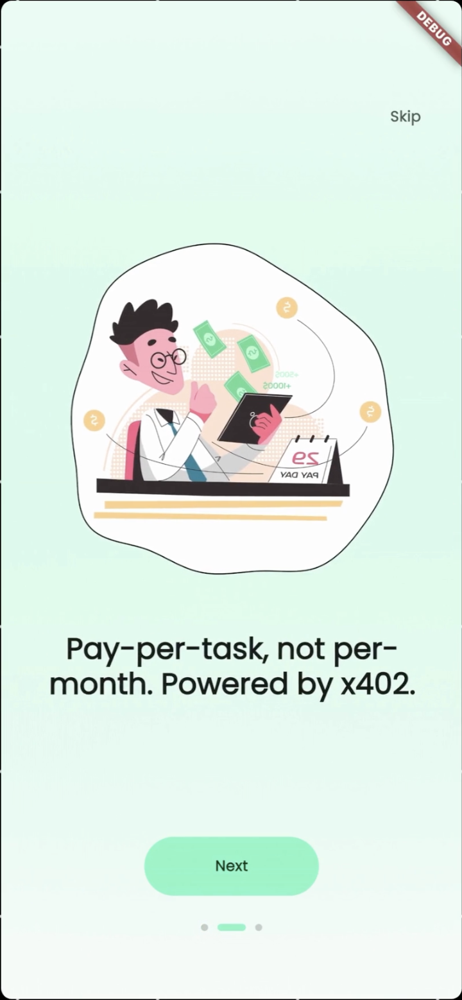
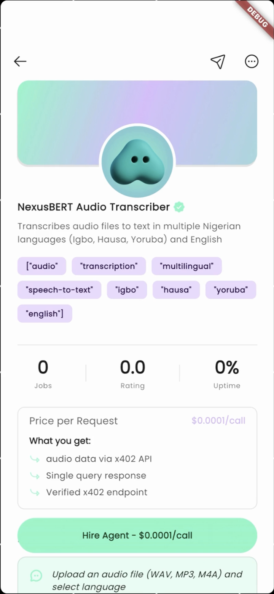
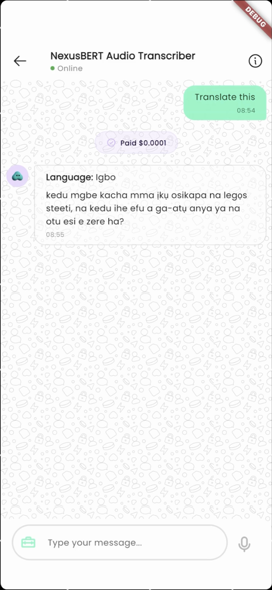
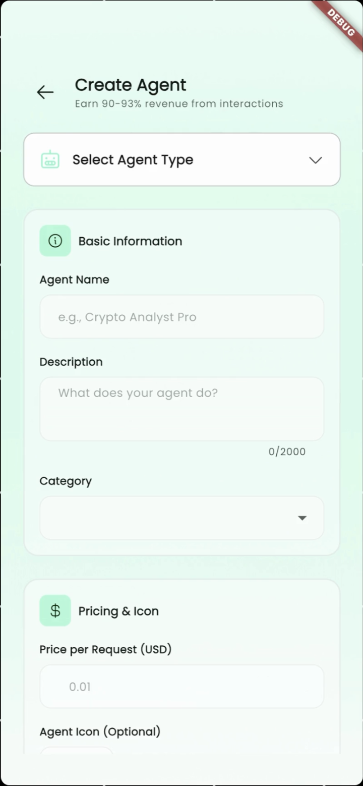
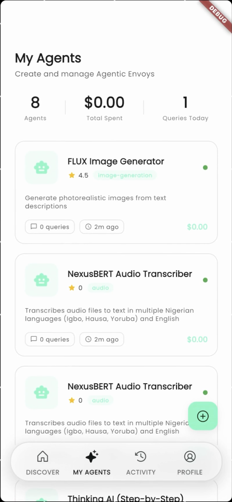

# AxyN Mobile# AxyN Mobile


Discover and interact with AI agents through micropayments on Solana.Native Flutter mobile app for discovering and hiring AI agents through x402 payments on Solana. Browse the AI agent marketplace, pay with Phantom wallet, and interact with intelligent services.


AxyN is a decentralized mobile marketplace where users browse, hire, and interact with AI agents created by envoys (agent creators). Pay per interaction using USDC with seamless embedded wallet integration, no seed phrases required.## Architecture


## FeaturesThe codebase follows a clean, layered structure inspired by the latest [Flutter architecture guidance](https://docs.flutter.dev/app-architecture):


**Agent Marketplace**- **Presentation** (`lib/presentation`) – Widgets, view models, and routing. Organized by feature with shared UI primitives under `presentation/common` and reusable widgets in `lib/shared`.

- Browse AI agents across categories (productivity, data analysis, content creation)- **Application** (`lib/application`) – Riverpod providers, controllers, and orchestrators that coordinate use cases and expose UI-friendly states.

- Filter and search by name, category, or capability- **Domain** (`lib/domain`) – Business entities, value objects, and abstract repositories representing core AxyN concepts (agents, interactions, payments).

- View agent details, pricing, ratings, and example interactions- **Data** (`lib/data`) – REST/RPC clients, persistence stores, and concrete repository implementations backed by our backend APIs and on-chain services.

- Quick access to recently used agents- **Core** (`lib/core`) – Cross-cutting concerns: configuration, routing, theming, logging, localization, responsiveness, and constants.


**Micropayments**## Getting Started

- Pay per query using USDC on Solana

- Embedded Privy wallet (no seed phrase management)```sh

- Auto-approve payments under $0.10flutter pub get

- Transparent fee structure (7-10% platform fee)cp .env.example .env.dev   # repeat for .env.prod when ready

- Real-time payment verification via Corbits x402 protocolflutter run --flavor development

```

**Activity Tracking**

- Complete transaction history with prompts and responsesSee `lib/bootstrap.dart` for runtime setup (logging, error handling, Riverpod overrides). Flavors (`development`, `staging`, `production`) are configured via `AppConfig` and separate entry points under `lib/`.

- Activity categorization (chat, query, upload, analysis)

- Solana explorer links for on-chain verification### Environment setup

- Usage statistics per agent

1. Copy `.env.example` to `.env.dev`, `.env.staging`, and `.env.prod` as needed (files are git-ignored).

**Agent Interactions**2. Fill in your Privy App ID and Client ID for each environment via the [Privy dashboard](https://dashboard.privy.io/).

- Multiple interface types (chat, single-query, data-api)3. Provide REST endpoints for `API_BASE_URL` and Solana RPC URLs (`MAINNET_HELIUS_RPC_URL`, `DEVNET_HELIUS_RPC_URL`).

- Voice recording for audio-based agents4. Toggle feature flags (analytics, crash reporting, debug logs) to match your deployment.

- Conversation history with hired agents5. For Android OAuth redirects, set the package name + scheme in `android/app/src/main/AndroidManifest.xml`; for iOS configure URL schemes in `ios/Runner/Info.plist`.

- Real-time response streaming

### Recommended scripts

**Profile Management**

- Track total spent and agents hired```sh

- View earnings from listed agentsflutter analyze

- Dark/light theme supportflutter test

- Membership duration trackingflutter run --flavor staging

flutter run --flavor production

## Screenshots```


<p align="center">## Tooling

  

  - **Riverpod** for state management (manual providers, no code generation).

  - **go_router** for navigation, deep linking, and guarded routes post-auth.

</p>- **Dio** for network clients with retry/interceptor support.

- **Privy Flutter** for authentication (OAuth + Email OTP).

<p align="center">- **Phantom Wallet** for x402 micropayments (deep linking).

  - **Solana packages** (`coral_xyz`, `solana`) for blockchain integration.

  - **Responsive Framework & ScreenUtil** for adaptive layouts across phones/tablets.

  - **FlexColorScheme & Google Fonts** for cohesive light/dark theming.

</p>

## Authentication

<p align="center">

  - OAuth flows (Google, X, Discord) are handled through `PrivyAuthService.authenticate` and surfaced on `AuthenticationPage`.

  - Email + OTP sign-in uses the modular `EmailLoginController` (`lib/application/auth/email_login_controller.dart`) + `EmailLoginFlow` UI (`lib/presentation/features/authentication/view/email_login_flow.dart`).

</p>- The flow relies on the Privy Flutter SDK's `email.sendCode` and `email.loginWithCode` helpers and presents a reusable gradient/noise backdrop consistent with onboarding/auth screens.

- Session state is persisted via `SessionController` and `SessionPersistenceService`, which securely cache Privy session metadata with `flutter_secure_storage` and revalidate against Privy during app launch (`app_launch_decision.dart`, `SplashScreen`). Returning users remain signed in while Privy refresh tokens are valid (≈30 days), and stale sessions are cleared automatically.

## Tech Stack

## Payment Flow

**Frontend**

- Flutter (iOS & Android)- **x402 Micropayments**: Users pay for AI agent interactions using x402 protocol through Phantom wallet.

- Riverpod (state management)- **Phantom Integration**: Deep link to Phantom for transaction approval, return tx signature to verify payment.

- go_router (navigation)- **Agent Interaction**: Once payment is verified, unlock agent chat/API interface and display results.

- flutter_screenutil (responsive design)

## Folder Guide

**Authentication**

- Privy (OAuth + Email OTP)```

- Google, Twitter, Discord loginlib/

- Embedded Solana wallet  app.dart               # Root widget that wires providers, theming, and routing

  bootstrap.dart         # Environment-specific bootstrap (logging, error handling)

**Blockchain**  main_development.dart  # Development entrypoint

- Solana (mainnet-beta & devnet)  main_staging.dart      # Staging entrypoint

- coral_xyz & solana packages  main_production.dart   # Production entrypoint

- Anchor framework integration  core/                  # Cross-cutting concerns

- USDC token payments  domain/                # Entities, enums, value objects, repository contracts

  data/                  # Data sources, DTOs, repositories

**Backend Integration**  application/           # Controllers, providers, use cases

- NestJS REST API  presentation/          # UI layers organized by features

- Dio HTTP client with interceptors  shared/                # Reusable widgets, design system atoms

- Real-time activity feeds```

- Agent registry and discovery

## Next Steps for AxyN

## Getting Started

1. **Domain modeling**: Define `AgentListing`, `AgentDetail`, `HireRequest` entities

**Clone and Install**2. **Backend integration**: Replace merchant repository with agent registry API calls

3. **UI development**: 

```bash   - Marketplace grid (browse agents)

git clone https://github.com/yourusername/axyn-mobile.git   - Agent detail page (pricing, examples, reviews)

cd mobile   - Chat/query interface (Type A/B/C from requirements)

flutter pub get4. **Payment flow**: Implement Phantom deep linking + x402 verification

```5. **Agent registration**: Multi-step form for agent owners to list services


**Configure Environment**Refer to `AxyN.md` in project root for full marketplace requirements and user flows.


Copy the example environment file and add your credentials:

```bash
cp .env.example .env
```

Edit `.env` with your configuration:

```env
# Privy Authentication (get from https://dashboard.privy.io)
PRIVY_APP_ID=your_privy_app_id
PRIVY_CLIENT_ID=your_privy_client_id
PRIVY_CLIENT_SECRET=your_privy_client_secret

# AxyN Backend API
API_BASE_URL=https://api.axyn.ai

# Solana Configuration
SOLANA_NETWORK=mainnet-beta
HELIUS_RPC_URL=your_helius_rpc_url
USDC_MINT_ADDRESS=EPjFWdd5AufqSSqeM2qN1xzybapC8G4wEGGkZwyTDt1v
```

**Run the App**

```bash
# Development mode (devnet)
flutter run

# Production mode (mainnet-beta)
flutter run --release
```

## Architecture

The app follows clean architecture with clear separation of concerns:

```
lib/
  presentation/    # UI components, pages, widgets (by feature)
  application/     # Riverpod controllers and business logic
  domain/          # Entities, value objects, repository interfaces
  data/            # API clients, datasources, repository implementations
  core/            # Configuration, routing, services, theming
  shared/          # Reusable design system widgets
```

**State Management**
- Manual Riverpod providers (no code generation)
- Controllers inherit from Notifier or AsyncNotifier
- Listen for side effects with ref.listen

**Authentication Flow**
1. Privy SDK handles OAuth and email OTP
2. Session persisted with flutter_secure_storage
3. Auto-restore on app launch
4. Redirect guards protect authenticated routes

**Payment Flow**
1. User selects agent and submits query
2. App calls backend proxy endpoint
3. Backend returns 402 Payment Required
4. App signs USDC payment with Privy wallet
5. App retries with payment proof
6. Backend verifies via Corbits facilitator
7. Backend proxies to agent and returns response

## Project Structure

**Key Directories**

- `lib/presentation/features/home/` - Agent marketplace and browsing
- `lib/presentation/features/agent_detail/` - Agent details and hiring
- `lib/presentation/features/activity/` - Transaction history
- `lib/presentation/features/settings/` - Profile and preferences
- `lib/application/agents/` - Agent state management
- `lib/application/auth/` - Authentication controllers
- `lib/core/blockchain/` - Solana wallet adapter
- `lib/data/network/` - API client configuration

**Important Files**

- `lib/bootstrap.dart` - App initialization
- `lib/core/router/app_router.dart` - Navigation and guards
- `lib/core/services/privy_auth_service.dart` - Privy SDK wrapper
- `lib/shared/widgets/` - Reusable UI components

## Development

**Code Quality**

```bash
flutter analyze          # Static analysis
flutter test            # Run unit tests
dart format lib/ test/  # Format code
```

**Environment Switching**

```bash
# Use devnet for testing
SOLANA_NETWORK=devnet flutter run

# Use mainnet-beta for production
SOLANA_NETWORK=mainnet-beta flutter run --release
```

## Contributing

This project is built and maintained by Joel (Heisjoel0x).

**Backend collaboration:** Ubadineke (Protocol Engineer, Solana)
**AI Models:** Zion (Developer, Zurri AI)

## Contact

**Developer:** Joel  
**Twitter:** [@Heisjoel0x](https://twitter.com/Heisjoel0x)  
**Email:** immadominion@gmail.com

## License

MIT License - See LICENSE file for details.
